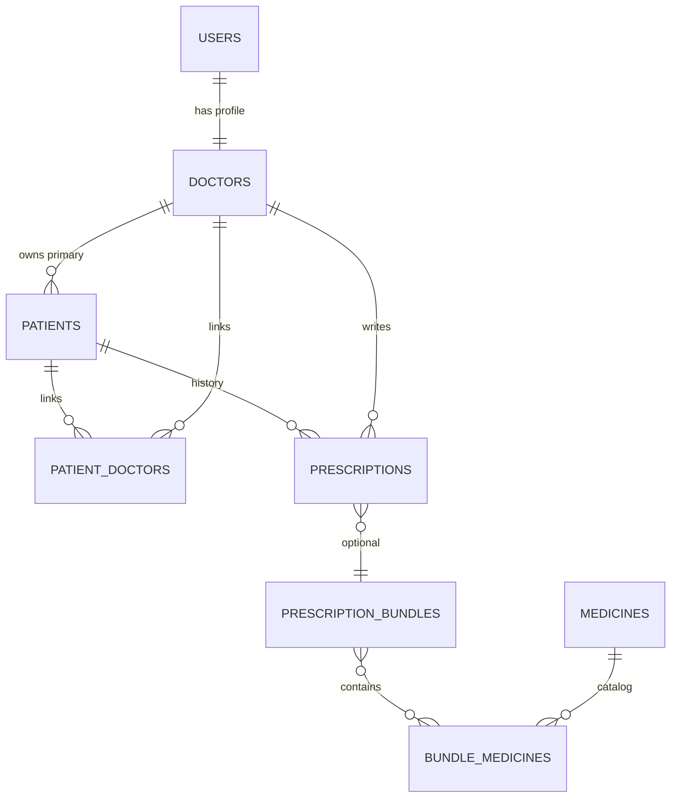

# VitalCache Backend — DATABASE DESIGN
Version: 0.9.0  
Last Updated: 2025-11-07  
Maintainer: @THE-AkS-21  
Status: DRAFT

---

## ERD

## Tables (key points)
- `patients(mobile_number)` indexed; `(patient_id, created_at)` index on `prescriptions`
- RLS enabled on **all** business tables
- `patient_doctors(patient_id, doctor_id)` as link table for multi-doctor care
