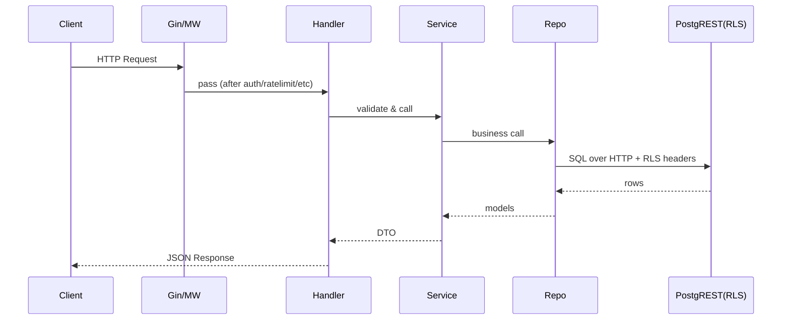

# VitalCache Backend — SYSTEM FLOW
Version: 0.9.0  
Last Updated: 2025-11-07  
Maintainer: @THE-AkS-21  
Status: DRAFT

---

## Request Lifecycle
1. recovery → requestid → logger → tracing → metrics → ratelimit → CORS → auth
2. handler validates DTO → service rules → repo → store → PostgREST (RLS)

## Auth / Token Refresh
- Access 15m, Refresh 30d (HttpOnly, Secure, SameSite=Strict, Path=/api/auth)
- Server validates access against **active or retained** HS256 keys (rotated every 7d)
