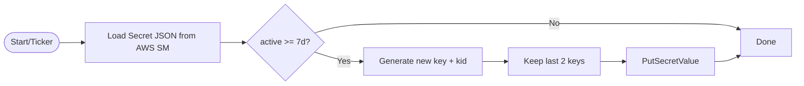

# JWT Key Rotation
Version: 0.9.0  
Last Updated: 2025-11-07  
Maintainer: @THE-AkS-21  
Status: DRAFT

---



<details><summary><b>Go: rotation ticker (excerpt)</b></summary>

```go
go func() {
  t := time.NewTicker(24 * time.Hour)
  for range t.C {
    _ = jwt.RotateIfNeeded(context.Background(), keySrc)
  }
}()
```
</details>
